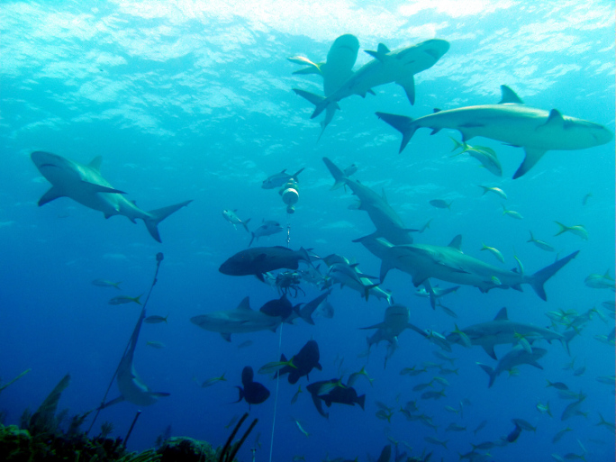

# OSGiフラグメントを使用したJSPのオーバーライド

[TOC levels=1-4]

OSGiフラグメントを使用してJSPを完全にオーバーライドできます。このアプローチは強力ですが、ホストモジュールがアップグレードされると状況が不安定になる可能性があります。

1. JSP全体をオーバーライドすることにより、新しいホストモジュールのバージョンに不可欠な新しいコンテンツまたは新しいウィジェットが考慮されなくなる可能性があります。
2. フラグメントは、特定のホストモジュールバージョンに関連付けられています。ホストモジュールがアップグレードされると、フラグメントはホストモジュールから切り離されます。このシナリオでは、元のJSPは引き続き使用可能で、モジュールは機能します（ただし、JSPの機能強化はありません）。
3. Liferayは、フラグメントによってオーバーライドされたJSPのアップグレードを保証できません。

OSGiフラグメントを使用してJSPをオーバーライドすることはバッドプラクティスであり、Extプラグインを使用して@product@をカスタマイズするのと同じです。最後の手段としてのみ使用してください。
一方、JSPをオーバーライドするLiferayのAPIベースのアプローチ（つまり[動的インクルード](/docs/7-1/tutorials/-/knowledge_base/t/customizing-jsps-with-dynamic-includes)および[ポートレットフィルター](/docs/7-1/tutorials/-/knowledge_base/t/jsp-overrides-using-portlet-filters)）は、オーバーライドしても安全なJSPの特定の部分をカスタマイズするため、より安定しています。また、APIベースのアプローチでは、オーバーライドが特定のホストモジュールバージョンに制限されることはありません。ただし、OSGiフラグメントを使用する既存のJSPオーバーライドを維持している場合は、このチュートリアルでその動作について説明します。

JSPをオーバーライドするOSGiフラグメントに必要なのは以下の2つです。

- OSGiヘッダー`Fragment-Host`宣言内のホストモジュールのシンボル名とバージョン。

- 必要な変更を加えた元のJSP。

フラグメントモジュールの詳細については、[OSGi Allianceのコア仕様ドキュメント](https://osgi.org/specification/osgi.core/7.0.0/framework.module.html)のセクション3.14が参考になります。

## フラグメントホストの宣言

このゲームには、フラグメントとホストの2人のプレイヤーがいます。フラグメントは、自分自身をホストに接続する寄生モジュールです。耳障りに聞こえるので、フラグメントとホストの関係をパイロットフィッシュと巨大で恐ろしいサメとの関係で比較しましょう。その関係はまさしく共生的です。フラグメントモジュールは、多くの作業を行うことなく恩恵を受けます（サメの獲物を捕獲する腕前から恩恵を受けるパイロットフィッシュのように）。その見返りに、ホストモジュールは、フラグメントのJSPで思いつくあらゆるメリットを享受します（サメの場合、パイロットフィッシュが歯をきれいにしてくれます）。OSGiランタイムにとって、フラグメントはホストモジュールの一部です。

フラグメントは、ホストモジュールに関してOSGiランタイムに2つのことを宣言する必要があります。

1. ホストモジュールのバンドルシンボル名。これは、元のJSPを含むモジュールです。

2. フラグメントが属するホストモジュールの正確なバージョン。

どちらもOSGiマニフェストヘッダー`Fragment-Host`を使用して宣言されます。

    Fragment-Host: com.liferay.login.web;bundle-version="[1.0.0,1.0.1)"

特定のホストモジュールバージョンを指定することが重要です。そのバージョンのモジュールが存在しない場合、フラグメントはホストにアタッチされませんが、これは正常な動作です。ホストモジュールの新しいバージョンによってJSPが変更された可能性があるため、現在互換性のないバージョンのJSPがホストモジュールに適用されると、ホストの機能が破壊されます。アプリケーション全体の機能を破壊するよりも、OSGiランタイムでフラグメントを切り離して孤立させたままにしておく方が適切です。

## オーバーライドされたJSPを提供する

ホストの元のJSPを対象とする命名規則は2つ考えられます。`portal`または`original`です。たとえば、元のJSPがフォルダ`/META-INF/resources/login.jsp`にある場合、フラグメントバンドルには、次のパターンを使用して、同じパスのJSPが含まれている必要があります。

    <liferay-util:include
    page="/login.original.jsp" (or login.portal.jsp)
    servletContext="<%= application %>"
    />

その後、変更を加えます。JARをオーバーライドするときは、必ずホストモジュールのフォルダ構造を模倣してください。例えば、Liferayのログインアプリケーションの `login.jsp`をオーバーライドする場合は、自分の`login.jsp`を次のように配置します。

    my-jsp-fragment/src/main/resources/META-INF/resources/login.jsp

出力を後処理する必要がある場合は、@product@のバッファリングメカニズムを含めるようにパターンを更新できます。以下は、元の`create_account.jsp`をオーバーライドする例です。

    <%@ include file="/init.jsp" %>
    
    <liferay-util:buffer var="html">
    <liferay-util:include page="/create_account.portal.jsp"
    servletContext="<%= application %>"/>
    </liferay-util:buffer>
    
    <liferay-util:buffer var="openIdFieldHtml"><aui:input name="openId"
    type="hidden" value="<%= ParamUtil.getString(request, "openId") %>" />
    </liferay-util:buffer>
    
    <liferay-util:buffer var="userNameFieldsHtml"><liferay-ui:user-name-fields />
    </liferay-util:buffer>
    
    <liferay-util:buffer var="errorMessageHtml">
    <liferay-ui:error
    exception="<%= com.liferay.portal.kernel.exception.NoSuchOrganizationException.class %>" message="no-such-registration-code" />
    </liferay-util:buffer>
    
    <liferay-util:buffer var="registrationCodeFieldHtml">
    <aui:input name="registrationCode" type="text" value="">
    <aui:validator name="required" />
    </aui:input>
    </liferay-util:buffer>
    
    <%
    html = com.liferay.portal.kernel.util.StringUtil.replace(html,
    openIdFieldHtml, openIdFieldHtml + errorMessageHtml);
    html = com.liferay.portal.kernel.util.StringUtil.replace(html,
    userNameFieldsHtml, userNameFieldsHtml + registrationCodeFieldHtml);
    %>
    
    <%=html %>

**注**：OSGiフラグメントは、フラグメントホストのすべてのパッケージにアクセスできます。別のバンドルからインポートする必要はありません。bndは、フラグメントが使用する外部パッケージ（フラグメントホストにあるものも含む）をフラグメントの`Import-Package: [package],...` OSGiマニフェストヘッダーに追加します。OSGiランタイムにエクスポートされたパッケージの場合はこれで問題ありません。問題は、bndがホストの内部パッケージ（ホストがエクスポートしていないパッケージ）をインポートしようとする場合です。内部パッケージが`Unresolved
| requirement`のままなので、OSGiランタイムはフラグメントをアクティブ化できません。フラグメントは、フラグメントホストのパッケージをインポートすべきではありません。
フラグメントがフラグメントホストからの内部パッケージを使用する場合は、引き続き使用しますが、バンドルの`Import-Package` OSGiマニフェストヘッダーからパッケージを明示的に除外してください。たとえば、次の`Import-Package`ヘッダーは、`com.liferay.portal.search.web.internal.*`に一致するパッケージを除外します。
|
|     Import-Package: !com.liferay.portal.search.web.internal.*,*

LiferayのアプリケーションのJSPを簡単に変更できるようになりました。

<!--https://commons.wikimedia.org/wiki/File:Carcharhinus_perezi_bahamas_feeding.jpg-->

サンプルのJSP変更フラグメントの動作を確認するには、[Module JSP Override sample project](/docs/7-1/reference/-/knowledge_base/r/module-jsp-override)をご覧ください

## 関連トピック

[Upgrading App JSP Hooks](/docs/7-1/tutorials/-/knowledge_base/t/upgrading-app-jsp-hook-plugins)
